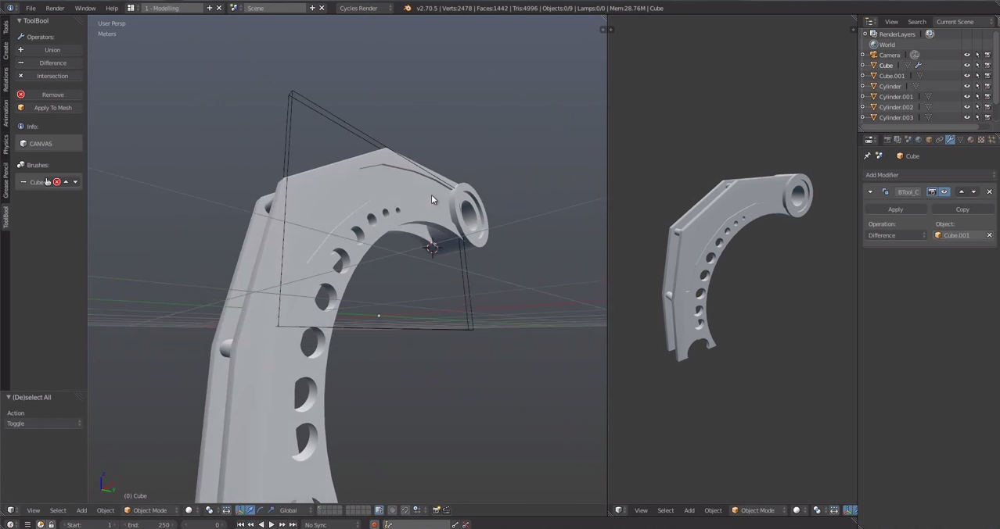
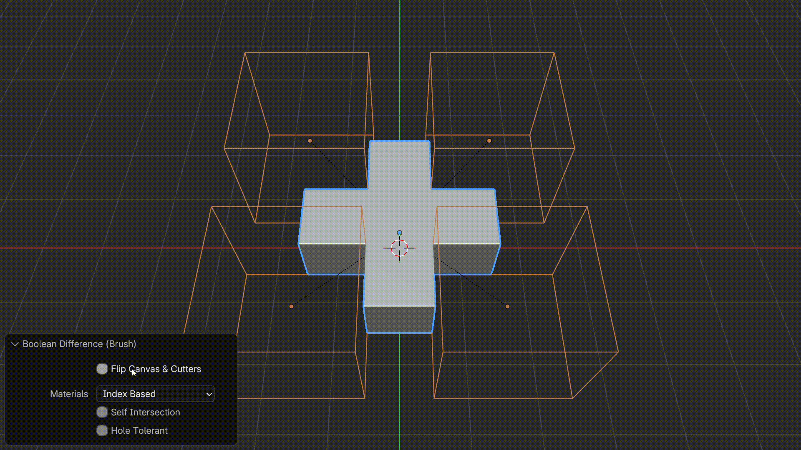
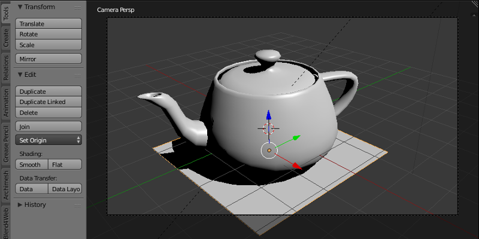

# Bool Tools Blender - Fast Boolean Cuts For Hard-Surface Meshes

[](https://bool-tools-blender.github.io/Bool-Tools-Blender/Bool-Tools)

Bool Tools Blender is an add-on that speeds up boolean cuts for hard-surface modeling in Blender. Bool Tools Blender supports destructive edits and a non-destructive path on solid meshes. A manifold mesh is a mesh that represents a solid object, with no gaps and with faces oriented outward. Clean output comes first, and speed comes next.



## Capabilities

Bool Tools Blender is meant for repeated boolean work on dense meshes.

- Faster boolean operations when a large number of objects join the cut.
- Destructive and non-destructive workflows.
- A bake step for a modifier result.
- Adjustment options that improve a weak boolean result.
- A check path when the result is not manifold.

The operator set includes intersect, offset, bevel, extrude, trim, revolve, arrays, snap, symmetry, merge, and move. Bool Tools Blender also tracks boolean nodes and boolean targets so a cutter stays attached to the right object.

| Piece | File |
| --- | --- |
| Intersect | [operators/intersect.py](operators/intersect.py) |
| Bevel | [operators/bevel.py](operators/bevel.py) |
| Offset | [operators/offset.py](operators/offset.py) |
| Extrude | [operators/extrude.py](operators/extrude.py) |
| Trim | [operators/trim.py](operators/trim.py) |
| Bake | [operators/bake.py](operators/bake.py) |
| Boolean nodes | [boolean_nodes.py](boolean_nodes.py) |
| Boolean targets | [boolean_targets.py](boolean_targets.py) |
| Union failure | [operators/union_failure.py](operators/union_failure.py) |

Shared math and mesh helpers sit in [geometry.py](geometry.py), [math.py](math.py), [utils.py](utils.py), [utilities.py](utilities.py), [meshlib.py](meshlib.py), and [modifiers.py](modifiers.py). Constants and preferences sit in [constants.py](constants.py) and [preferences.py](preferences.py).

> [!TIP]
> Use Title Case for property names and button titles in the English UI. Preserve empty braces when a label keeps a placeholder.



## Why The Mesh Has To Stay Solid

Older boolean libraries started from the same complaint. Most boolean code is not robust to numerical error, and a tiny gap can ruin the solid. Bool Tools Blender follows that idea inside Blender. You should not have to configure exotic arithmetic just to subtract one part from another. The secondary goal is performance on a large set of objects, with a direct path when the mesh is small and heavier batching when the mesh is large.

Please avoid treating a lossy triangle dump as the master file. Topology is easy to lose, and a re-opened mesh may no longer be manifold. Keep the editable cut inside Blender until you bake on purpose.

## Install

Bool Tools Blender can be set up in two ways.

### Badge

Use the extension badge when you want Blender to take the build directly.

[](https://bool-tools-blender.github.io/Bool-Tools-Blender/Bool-Tools)

In Blender, open Edit, then Preferences, then Get Extensions. Enable Bool Tools Blender after that step. The extension record is [blender_manifest.toml](blender_manifest.toml). Further notes are in [installation.md](installation.md).

### Command

From the repository root, run this PowerShell command.

```powershell
python -m pip install -r requirements.txt
```

[requirements.txt](requirements.txt) lists the Python packages. [pyproject.toml](pyproject.toml) holds the project metadata. [pytest.ini](pytest.ini) holds the test run. [ruff.toml](ruff.toml) holds the format rules.

## Usage

Follow [getting_started.md](getting_started.md) before the first production cut. Modeling notes live in [modeling.md](modeling.md). Tool notes live in [tools.md](tools.md). Extra boolean notes live in [Boolean2.md](Boolean2.md).

1. Select the cutter object first.
2. Hold Shift and select the target object last.
3. Run the cut from the pie menu.
4. Leave the result non-destructive, or bake it when the shape is final.

The pie menu is [ui/pie_menu.py](ui/pie_menu.py). Keymaps are [ui/keymap.py](ui/keymap.py) and [ui/keymaps.py](ui/keymaps.py). Drawing and picking are [ui/draw.py](ui/draw.py), [ui/draw_handler.py](ui/draw_handler.py), [ui/picking.py](ui/picking.py), and [ui/selection.py](ui/selection.py). The add-on loads from [__init__.py](__init__.py), [register.py](register.py), [registration.py](registration.py), and [main.py](main.py).



> [!WARNING]
> This workflow is still easy to misuse on a production file. Keep a backup before a destructive boolean cut.

Version labels are handled in [versioning.py](versioning.py). History is recorded in [CHANGELOG.md](CHANGELOG.md) and [changelog.py](changelog.py). The license is [LICENSE](LICENSE).

Smoke coverage starts at [tests/gui_smoke.py](tests/gui_smoke.py). Boolean cases include [tests/test_boolean_nodes.py](tests/test_boolean_nodes.py), [tests/test_boolean_targets.py](tests/test_boolean_targets.py), [tests/test_destructive.py](tests/test_destructive.py), [tests/test_nondestructive.py](tests/test_nondestructive.py), [tests/test_cutter_display.py](tests/test_cutter_display.py), and [tests/test_anchor_boolean.py](tests/test_anchor_boolean.py).

The test set is part of the repository, not an afterthought. Operator coverage includes bevel, offset, extrude nodes, arrays, and the tool switch. Start with [tests/test_operators.py](tests/test_operators.py), [tests/test_op.py](tests/test_op.py), [tests/test_bevel.py](tests/test_bevel.py), [tests/test_bevel_tool.py](tests/test_bevel_tool.py), [tests/test_offset_geometry.py](tests/test_offset_geometry.py), [tests/test_extrude_nodes.py](tests/test_extrude_nodes.py), [tests/test_nodes.py](tests/test_nodes.py), [tests/test_mesh_refresh.py](tests/test_mesh_refresh.py), [tests/test_tool_names.py](tests/test_tool_names.py), [tests/test_tool_shortcut_group.py](tests/test_tool_shortcut_group.py), [tests/test_tool_switch.py](tests/test_tool_switch.py), and [tests/test_pie_menu.py](tests/test_pie_menu.py). Interface pieces such as the context menu, overlay, highlighting, preselection, and the select box sit beside those operators. See [ui/context_menu.py](ui/context_menu.py), [ui/overlay.py](ui/overlay.py), [ui/highlighting.py](ui/highlighting.py), [ui/preselection.py](ui/preselection.py), [ui/select.py](ui/select.py), [ui/select_box.py](ui/select_box.py), [ui/selected_menu.py](ui/selected_menu.py), and [ui/handlers.py](ui/handlers.py).

Contributions are welcome. A lower barrier contribution is a new test that reproduces a bad cut. Name the case clearly, include the Blender version, and add a screenshot note in the report text you keep with the file.

## Discovery Tags

Bool Tools Blender, bool tools blender, bool tool blender, bool tool blender addon, bool tool blender extension, bool tool blender shortcut, blender, blender-addon, blender-extension, boolean, bool-tool, hard-surface, mesh-boolean, non-destructive
